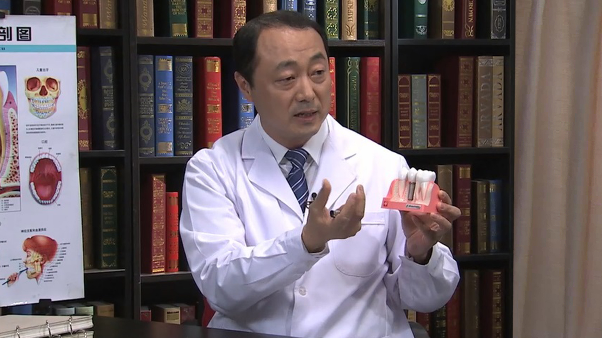

# 12.56 种植牙//柳忠豪教授

---

## 柳忠豪 主任医师

烟台市口腔医院院长 滨州医学院口腔医学院院长。

国际种植学会(ITI)中国分会主席；中华医学会口腔种植专业委员会常委；山东省口腔医学会副会长；山东省口腔医学会口腔美学专业委员会主任委员；烟台市口腔医学会会长；国际牙医师学院（ICD）院士。

**主要成就及论文编著：** 主持参与省市科研课题十余项，培养硕士研究生三十余名；获“山东省十佳青年医师”“山东省优秀医院院长”“烟台市十大医界英才”“烟台市有突出贡献的中青年专家”等荣誉称号；在SCI期刊源杂志发表论文11篇，中华口腔医学杂志发表论文12篇，中文核心杂志发表学术论文50余篇，参编著作8部。

**专业特长：** 1994年开始从事口腔种植临床工作，主要研究方向为种植体表面体外评价、种植体周围骨改建等。擅长各种骨增量外科技术、拔牙后即刻种植技术、微创种植技术、计算机导航种植技术。

---
