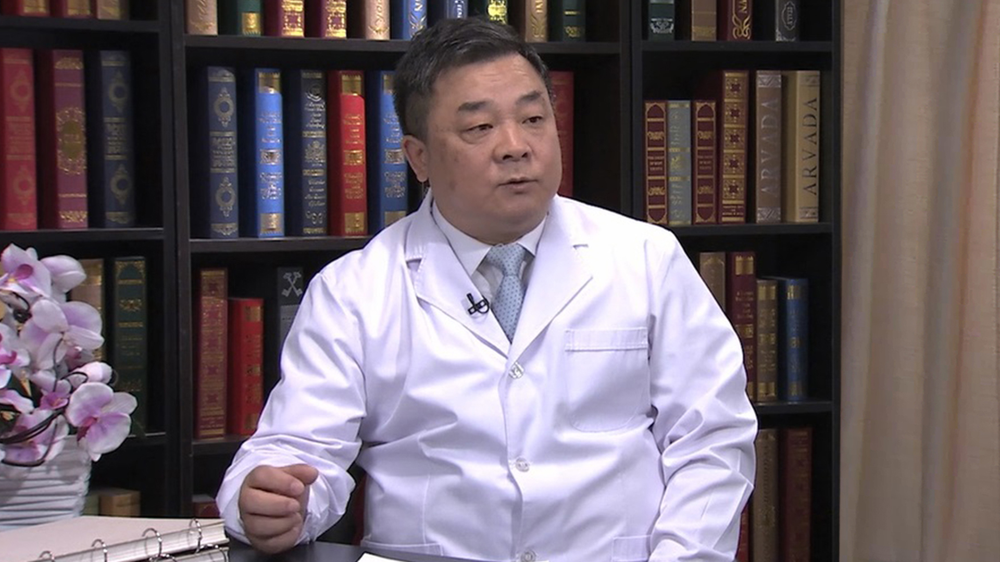

# 12.57 种植牙//周延民教授

---

## 周延民 主任医师

吉林大学口腔医学院院长、吉林大学口腔医院口腔种植中心主任 主任医师。

中华口腔医学会口腔种植专业委员会副主任委员、中国医师协会口腔医师协会副会长、中华口腔医学会常务理事、中华口腔医学会口腔修复专业委员会常委、中华口腔医学教育委员会常委、国际牙医学院院士（fellow）、国际口腔重建科学委员会中国分会常委、ITI国际口腔种植协会院士（fellow）

**主要成就：** 公开发表论文300余篇，30篇被SCI收录；曾获吉林省科技进步奖一等奖1项、中华口腔医学会科技进步奖三等奖1项，吉林省科技进步二等奖、三等奖各1项，吉林省自然科学学术成果奖三等奖2项、长春市科技进步奖一等奖1项、长春市科技创新奖1项，吉林大学医疗成果一等奖、二等奖各1项，三等奖3项。

**专业特长：** 与美国哥伦比亚大学合作，创建了东北地区第一个专业化的口腔种植中心，为吉林省口腔种植事业的发展奠定了基础。擅长即刻种植即刻修复术、onlay植骨术、自体骨/异体骨移植技术、引导骨再生技术、骨劈开骨挤压技术、3D打印辅助下牙槽神经移位手术及PRF等，达到国内领先水平, 扩大了种植修复的适应证，提高了医疗质量和种植修复的成功率，为广大患者带来了福音。

---
