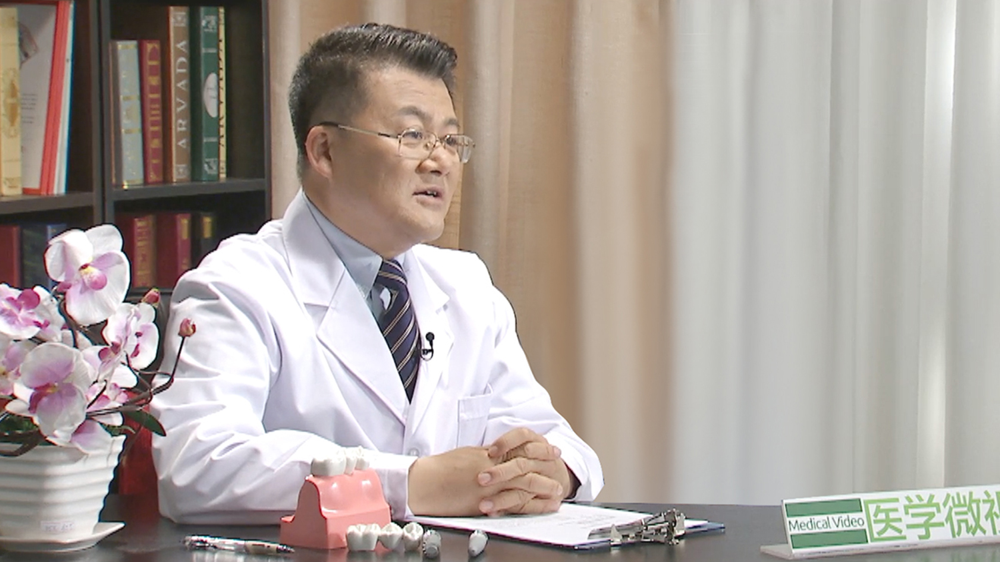

# 12.58 种植牙//徐宝华教授

---

## 徐宝华 主任医师

中日友好医院口腔医学中心主任 主任医师 教授；北京大学教授；北京中医药大学教授。

国际牙医师学院院士；英国爱丁堡皇家外科学院院士；中华全科口腔医学专业主任委员；中华口腔颌面疼痛学组组长；国际口腔激光应用学会中国分会副会长；北京医师协会口腔医师分会副会长；北京口腔全科医学专委会主任委员；世界正畸学会会员；《全科口腔医学杂志》主编；国家临床医生科普项目专家委员会及中国医学科学院健康科普研究中心特聘科普专家。

**主要成就：** 曾赴美国宾夕法尼亚大学进行牙周正畸种植专业访问学者，积累了大量目前国际种植前沿科学进展方面的科学理论及临床经验；在国内外专业杂志上发表论文篇70余篇；主编论著一部，副主编论著三部；主译论著两部；先后主持和承担国家级和省部级科研课题七项； 获国家发明专利和实用新型专利共五项； 获卫生部及教育部科技进步奖共三次； 获国家卫生部“十年百项推广项目”一项（2005）应邀在国内二十余个省市讲学百余场； 2013年、2014年两度当选全国十佳名医（口腔医学专业唯一当选专家）；世界舌侧正畸学会认证舌侧正畸专科医师。

**专业特长：** 种植；牙周；正畸综合治疗。

---
