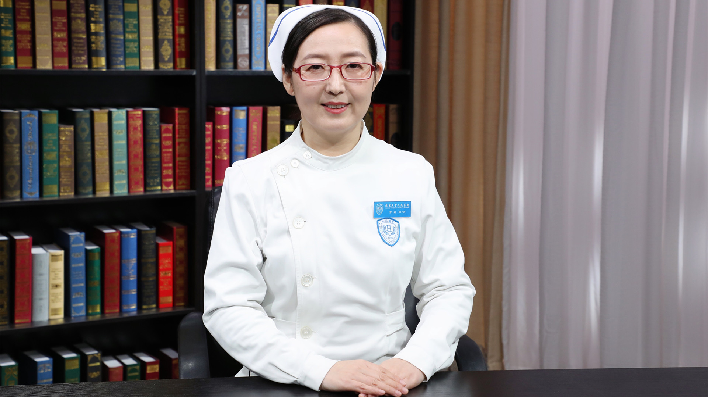

# 12.59 种植牙护理

---

## 罗葳 副主任护师

北京大学人民医院口腔科护士长；北京护理学会口腔科专业委员会副主任委员。

中华护理学会口腔科护理专业委员会委员；北京口腔医学会口腔护理专业委员会副主任委员；中华口腔医学会口腔护理专业委员会委员。

**主要成就：** 发表论文20篇；主编书籍1部，副主编书籍1部，参编书籍2部；每年承担护理继续教育项目。

**专业特长：** 擅长口腔临床护理及管理。

---
