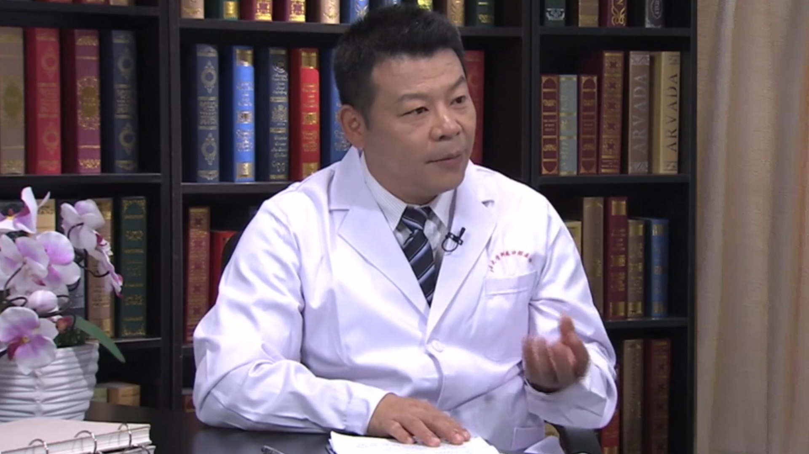

# 12.61 阻生智齿的治疗

---

## 王予江 主任医师

南昌大学附属口腔医院副院长 口腔颌面外科主任医师 硕士生导师。

中华口腔医学会口腔颌面外科专业委员会常委；江西省口腔医学会口腔颌面外科专业委员会主任委员；江西省研究型医院协会常务理事；《口腔颌面外科杂志》编委；《口腔疾病防治杂志》编委。

**主要成就：** 以主要参与人获国家级项目1项支持，主持省部级项目2项，厅级项目13项；发表专业论文30余篇，致力于牙槽外科疾病及先天性唇腭裂、牙槽裂、牙颌面畸形的基础和临床研究，相关研究获江西省科协第三届优秀学术论文一等奖。

**专业特长：** 擅长于牙槽外科疾病的诊断与治疗，先天性唇腭裂、牙槽裂及牙颌面畸形的整复治疗及颞下颌关节病的诊断及治疗，尤其对牙槽外科、唇腭裂、牙槽裂及牙颌面畸形的整复治疗有深入的研究。

---
