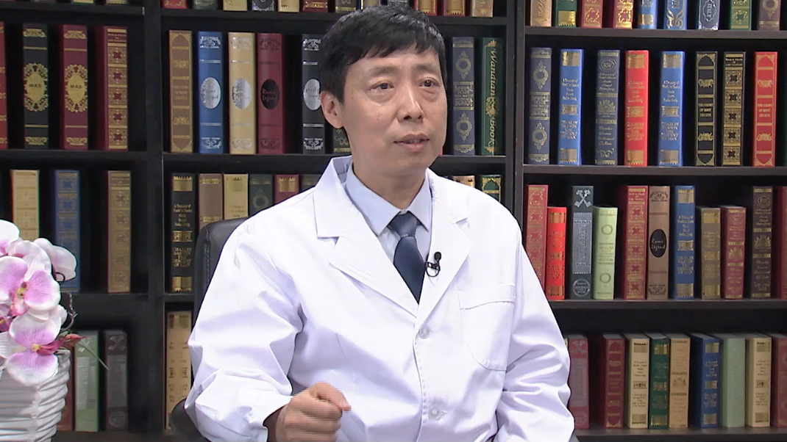

# 13.1 白癜风

---

## 李邻峰 主任医师

首都医科大学附属北京友谊医院皮肤科主任 主任医师 医学博士 博士生导师。

中国中药协会皮肤病药物研究专业委员会主任委员；中国医师协会皮肤病分会过敏专业委员会副主任委员；中国中西医结合学会皮肤病分会药物临床评价委员会副主任委员；北京中西医结合学会环境与健康专委会主任委员；医学美容专业委员会常委及现代医学美容学组组长。

**主要成就：** 发表论文150余篇，SCI论文50余篇，主编专著10余部，参编多部；致力皮肤免疫与过敏性皮肤病、各类皮炎湿疹、白癜风、脱发及皮肤美容的研究，获得国家级、省部级及各类研究项目多项支持。

**专业特长：** 擅长于过敏性皮肤、免疫性皮肤病、接触性皮炎、各类皮炎湿疹、白癜风、脱发、银屑病及皮肤美容问题等疾病的诊断与治疗。尤其对皮炎湿疹、皮肤过敏有深入的研究。

---
