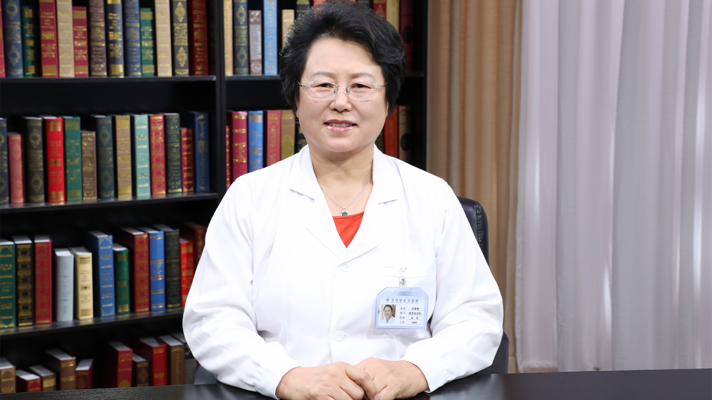

# 13.7 花粉过敏

---

## 王学艳 主任医师

首都医科大学附属北京世纪坛医院变态（过敏）反应中心主任 主任医师。

中华医学会变态反应学分会副主任委员；中国医师协会变态反应医师分会常务委员；中国医疗保健国际交流促进会过敏科学分会副主任委员；中国医疗保健国际交流促进会过敏科学分会副会长；北京医学会过敏变态反应学分会主任委员；北京中西医结合学会变态反应专业委员会副主任委员；北京中西医结合学会理事会常务理事。

**主要成就：** 国家临床重点专科项目负责人、变态反应科学科带头人；主编《食物过敏诊疗与病例分析》《中国北方植物花粉调研——花粉形态及花粉过敏疑难病例》专著2部，参编《临床变态反应学》《过敏性鼻炎》等专业书籍6部；发表学术论文50余篇，其中SCI 10余篇；1999年率先在国内开展了阿罗格的特异性免疫治疗，2005年率先在国内开展舌下特异性免疫治疗，2008年率先在国内开展类变应原的特异性免疫治疗。

**专业特长：** 擅长治疗如湿疹、皮炎、花粉病、过敏性鼻炎、哮喘、结膜炎、复发性口腔溃疡、夜尿症、偏头痛、过敏性紫癜、小儿多动症等过敏相关常见病和疑难病。

---
