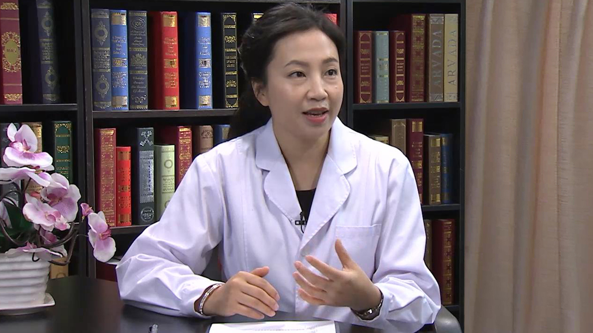

# 13.9 化妆品皮肤病

---

## 吴艳 主任医师

北京大学第一医院皮肤科主任医师。

中华医学会皮肤性病学分会皮肤美容学组成员；中国医师协会皮肤科分会注射美容亚专业委员会副组长；中国中西医结合皮肤性病专业委员会美容化妆品研究会副秘书长；中国整形美容协会理事会理事；中国整形美容协会微创与皮肤整形美容分会秘书长；中国整形美容协会微创与皮肤美容分会委员；中国照明学会第六届光生物和光化学专业委员会委员。

**主要成就：** 获得国家自然科学基金、北京市自然科学基金及国外合作项目和中华医学会及医师协会基金资助； 共计在核心期刊及SCI收录期刊上发表论文60余篇，SCI收录的文章11篇； 参与编写书籍20余本，其中主编3本。

**专业特长：** 擅长皮肤科疾病的诊治，尤其在美容皮肤方面有一定的造诣；科研方面主要致力于皮肤生理方面；在色素性皮肤病、皮肤光生物学及皮肤屏障方面做了一定研究；熟练掌握激光治疗、化学换肤、肉毒毒素和填充剂注射等美容治疗技术。

---
