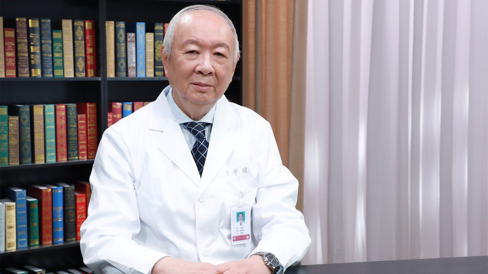

# 13.21 皮肤护理

---

## 朱学骏 主任医师

北京大学第一医院皮肤性病科主任医师 博士生导师 终身教授。

中国医师协会皮肤科医师分会名誉会长；国家皮肤与免疫疾病临床医学研究中心学术委员会主任；第八、九届国家药典委员会委员 第十届特别顾问；美国及德国皮肤科协会名誉会员。

**主要成就：** 1994年获卫生系统有突出贡献的中青年专家称号；2007年获第四届中国医师奖、北京大学医学部桃李奖；2013年获北京大学国华杰出学者奖；在国内外发表论文400余篇，著作十余部，主要有《中国皮肤病性病图鉴》《皮肤病的组织病理学诊断》等；参与并主持《中国国家处方集》《中华人民共和国药典临床用药须知》《中国大百科全书》中皮肤科学部分的编写，主译《Bolognia皮肤病学》。

**专业特长：** 数十年耒始终在医疗第一线工作，积累了丰富的临床经验；擅长治疗大疱性皮肤病及解决皮肤科的疑难杂症；重视基础研究，在国际上首先提出了副肿瘤性天疱疮的发病机理。

---
