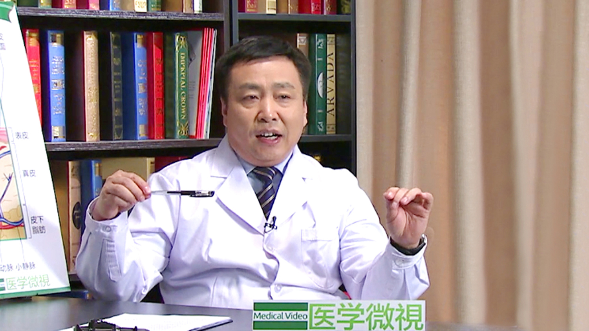

# 13.26 荨麻疹（风疙瘩）

---

## 张建中 主任医师

北京大学皮肤病与性病学系主任；北京大学人民医院皮肤科主任。

中华医学会皮肤性病学分会主任委员；亚洲皮肤科学会理事；中国医师协会皮肤性病学分会副会长；中华医学会皮肤性病学分会特应性皮炎（湿疹）研究中心首席专家；北京市中西医结合学会变态反应专业委员会副主任委员；《中华皮肤科杂志》等多本杂志副主编；《Chinese Medical Journal》等杂志编委；《European Journal of Dermatology》《Journal of Dermatological Science》审稿人。

**主要成就：** 牵头组织了我国特应性皮炎、湿疹、皮肤型红斑狼疮、荨麻疹、男性型脱发等多种常见皮肤病诊疗指南的制定; 主持了多项国家级和省部级科研项目，包括科技部重大专项基金、国家自然科学基金、卫生部重点科研基金等; 发表论文400余篇，主编和参编学术专著40多部；获中华医学奖和北京大学科研成果奖多项；多次应邀到国外讲学和进行学术交流，为推动我国皮肤科的发展以及我国皮肤科与世界皮肤科的交流做出了贡献；2013年获国际皮肤科联盟（ILDS）“杰出贡献奖”。

**专业特长：** 擅长特应性皮炎；红斑狼疮；银屑病；毛发病等。

---
