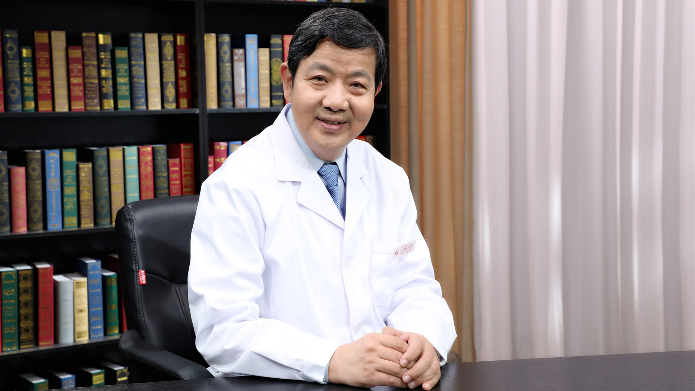

# 13.27 瘙痒

---

## 陈勇 主任医师

首都医科大学附属北京朝阳医院党委副书记 中医科主任医师。

中华中医药学会综合医院中医药工作委员会副主任委员；北京中医药学会理事会副会长。

**主要成就：** 在北京中医医院皮肤科、北京朝阳医院中医科从事中医皮肤科临床、教学、科研工作三十余年，全国名老中医陈彤云学术继承人，北京市中医管理局培养的首批“125计划”中医药人才；2012年获“第二届首都群众喜爱的中青年名中医”称号；曾主持或参与国家中医药管理局和北京市中医管理局多项科研课题研究，先后获得国家中医药管理局和北京市中医管理局科技成果奖；参与编写国家中医药管理局《中医病证诊断疗效标准》《中医医院分级评审技术标准（修订）》和“中医全科医师培训大纲”（皮肤科专业）；发表论文十余篇，参与编写《美容中医学》等专著六部。

**专业特长：** 擅长中医、中西医结合方法治疗痤疮、黄褐斑等损容性皮肤病及瘙痒性、过敏性皮肤病，银屑病及湿疹皮炎。

---
