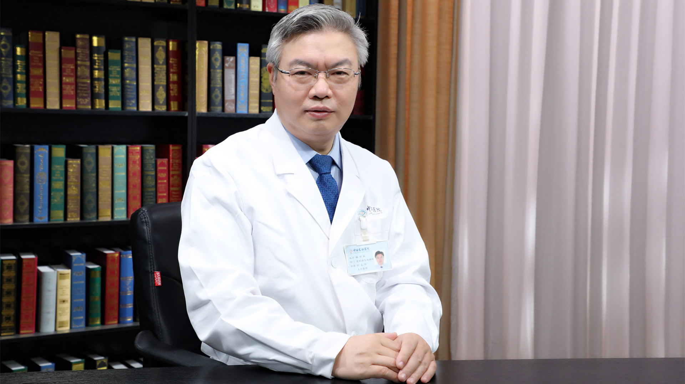

# 13.35 脱发植发

---

## 杨顶权 主任医师

中日友好医院皮肤病与性病科副主任 教授 主任医师。

毛发专病医联体负责人 毛发医学中心主任 美容主诊医师；中日友好医院皮肤健康研究所副所长；中华医学会皮肤性病学分会毛发病学组委员 整形外科分会毛发移植学组委员；中华中医药学会皮肤科分会委员兼毛发学组副组长；中国医师协会皮肤科医师分会委员兼皮肤科专家委员会委员 美容与整形医师分会毛发移植学组委员。

**主要成就：** 目前主持毛发方向国家自然基金2项、省部级课题2项；发表论文100余篇，其中SCI论文10篇,发明专利2项。

**专业特长：** 主要从事中西医结合的皮肤疾病诊治、头皮健康管理、医学美容；擅长毛发疾病、瘢痕疙瘩、痤疮、慢性湿疹、银屑病、皮肤肿瘤等疑难性皮肤病和医学美容的临床及科研工作。

---
