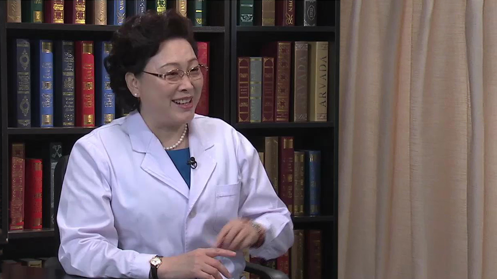

# 13.44 婴儿血管瘤

---

## 马琳 主任医师

首都医科大学附属北京儿童医院皮肤科主任 主任医师 教授。

中华医学会儿科学分会第十七届委员会皮肤病与性病学组组长；中华医学会皮肤性病学分会第十四届儿童皮肤病学组副组长；中华医学会北京分会皮肤性病学分会副主任委员；中华医学会整形外科学分会第七届委员会血管瘤与脉管畸形学组委员；中国医师协会皮肤科医师分会第三届儿童皮肤病亚专业委员会主任委员；中国医师协会皮肤科医师分会第二、三届委员会常务委员。

**主要成就：** 以第一作者或通讯作者发表文章百余篇，其中SCI收录15篇；主编中国第一部《儿童皮肤病彩色图谱》；主编中国第一部专科医师培训教材《儿童皮肤病学》；主译《儿童皮肤病学》一部；副主编、副主译各一部，参加了30余部书的编写。

**专业特长：** 在儿童皮肤病的诊断与治疗方面达到国际一流水平；擅长特应性皮炎/湿疹患儿的长期治疗与管理、皮肤血管瘤的综合治疗、感染性皮肤病、儿童皮肤异常的激光治疗、遗传性皮肤病等。

---
