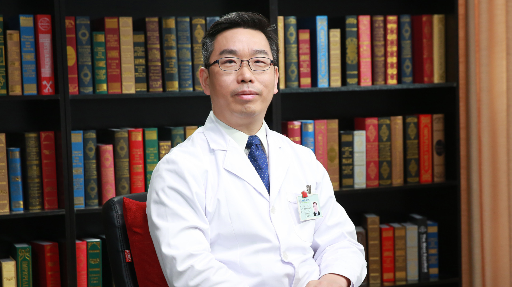

# 13.49 鱼鳞病

---

## 崔勇 主任医师

中日友好医院副院长 皮肤病与性病科主任 主任医师 博士生导师.

中国医学装备人工智能联盟皮肤科委员会主任委员；国家远程医疗与互联网医学中心皮肤科专委会主任委员；中国医学装备协会皮肤病与皮肤美容分会副主任委员兼秘书长；中国人群皮肤影像资源库项目（CSID）发起人 组长；享受国务院特殊津贴。

**学术成就：** 发表SCI论文100余篇，累计影响因子792分；作为负责人承担国家自然科学基金面上项目6项、973项目课题1项、安徽省杰出青年基金1项；担任国家规划教材《皮肤性病学》学生版（第9版）副主编、图谱版（第1版）副主编、图谱版（第2版）主编；获得中华医学科技奖一等奖、国家科学技术进步奖二等奖、教育部自然科学奖一等奖、第十一届中国青年科技奖、教育部高校自然科学奖二等奖、安徽省科学技术奖一等奖。

**专业特长：** 擅长常见皮肤病诊治、罕见及疑难重症皮肤疾病的临床及基因诊断、皮肤病影像学诊断及远程医疗等。

---
