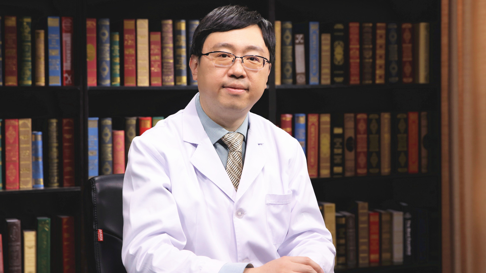

# 13.51 痣样黑斑

---

## 李航 主任医师

北京大学第一医院副院长 皮肤科主任 主任医师.

中国医师协会皮肤科医师分会总干事 皮肤外科亚专业委员会主任委员；中国整形美容协会美容皮肤科分会常委；中国中西医结合学会皮肤科分会皮肤外科学组副组长 皮肤图像技术学组委员；国际皮肤镜协会理事；国际皮肤外科协会（SIDS）会员；《中国皮肤性病学杂志》编委。

**主要成就：** 主持国家自然科学基金、首都临床特色应用研究基金等多项课题；获中国医师协会皮肤科医师分会优秀中青年医师奖；获“北京市青年岗位能手”称号；发表论文70余篇；主编或主译著作7部，参编（译）12部。

**专业特长：** 擅长皮肤外科、皮肤肿瘤等领域的临床、科研工作。

---
