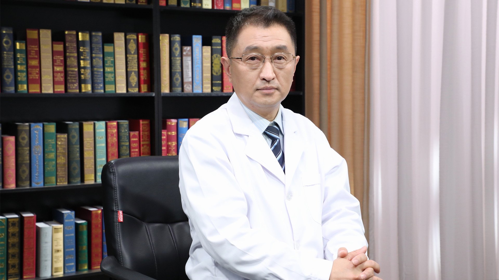

# 13.53 足癣（脚气）

---

## 姚志远 主任医师

中日友好医院皮肤病与性病科主任医师 北京大学医学部硕士生导师.

中华医学会皮肤性病学分会真菌学组委员；中国医师协会皮肤科医师分会感染性皮肤病亚专业委员会委员；中国医疗保健国际交流促进会皮肤科分会全国委员；中国老年医学学会皮肤病与皮肤衰老防治专家委员会常委；中国医学装备人工智能联盟皮肤科委员会专家委员；中国康复医学会皮肤病康复专业委员会皮肤性病康复学组委员；北京中西医结合学会环境与健康专业委员会常委；北京医师协会皮肤科医师分会常务理事。

**主要成就：** 主持科研课题多项，发表专业论文50余篇，其中SCI文章4篇；参编皮肤病学专业著作2部，参编人卫版皮肤病学教材3部。

**专业特长：** 擅长治疗真菌感染性皮肤病如甲癣、手足癣、体股癣等以及性传播疾病如尖锐湿疣、生殖器疱疹、梅毒等；对银屑病、白癜风、酒糟鼻、湿疹皮炎、老年瘙痒症等顽固难治性皮肤病及疑难危重性皮肤病的诊治有丰富的临床经验；熟练掌握皮肤美容技术及皮肤肿瘤手术治疗技术。

---
