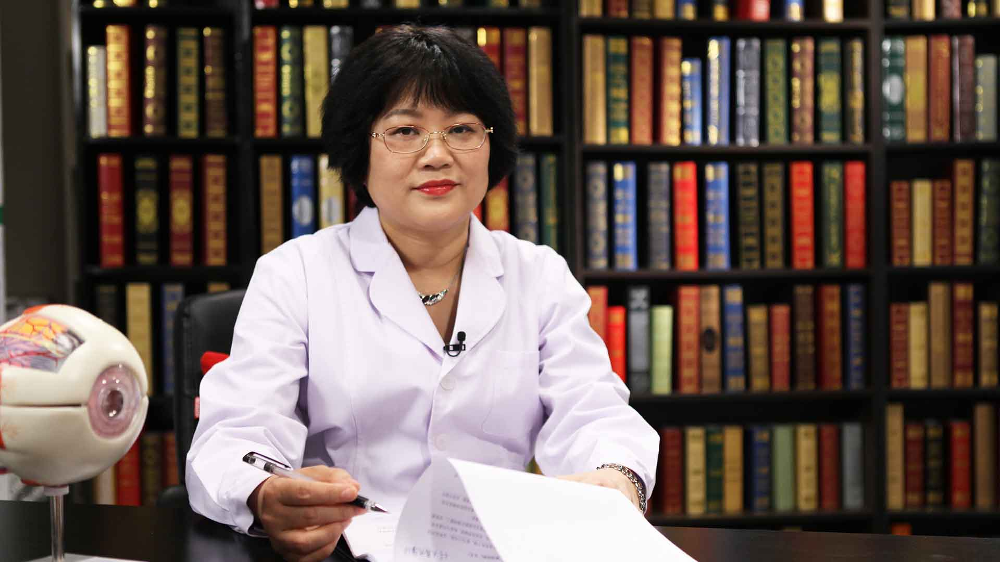

# 14.2 白内障//秦虹教授

---

## 秦虹 主任医师

中国中医科学院眼科医院白内障中心行政主任 主任医师 眼科学硕士导师。

中华医学会眼科学分会白内障组会员；中国医师协会中西医结合眼科专家委员会委员；中国微循环协会眼微循环专业委员会理事；中国民族医药学会眼科分会副秘书长；世界中医药学会联合会眼科专业委员会秘书长。

**主要成就：** 创立“白内障小切口隧道内碎核技术”， 3分钟完成1例白内障手术，现完成白内障手术150000余例；被四家医院聘为客座教授，指导美国伯克利视光学院博士生眼科实习。

**专业特长：** 从事眼科手术近30年，北京最早开展二焦点，三焦点，散光等高端人工晶状体私人定制的医生，能将白内障、高度近视、远视、散光、老花眼3分钟无痛消除。擅长将青光眼、白内障、视网膜脱离、玻璃体出血、黄斑水肿、病理性近视等眼科病一次性多联合手术解决，免去了患者多次眼科手术的痛苦和花费。

---
