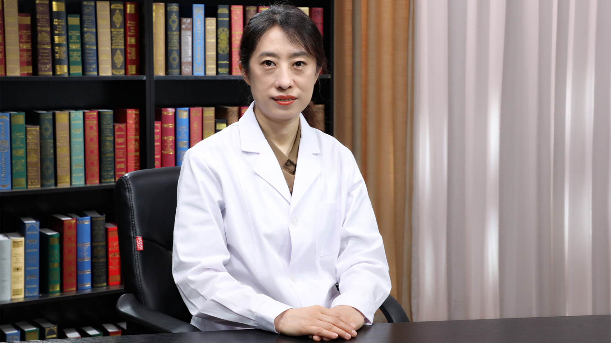

# 14.4 玻璃体混浊

---

## 喻晓兵 主任医师

北京医院眼科副主任 主任医师 教授 博士生导师。

中国医师协会眼科分会眼底病专业委员会委员；中国卫生信息与健康医疗大数据学会眼科专业委员会秘书长；世界中医药学会联合会眼科专业委员会常务理事；北京医学会眼科学分会委员；北京眼科学会教育委员会委员。

**主要成就：** 发表SCI及中文论文50余篇，参与著书4部；主持和参与国家级及省部级科研课题27项，获科研成果奖2项，获新技术奖4项，发明专利2项，实用新型专利4项。

**专业特长：** 擅长眼底病尤其是黄斑病变的药物治疗、激光治疗及玻璃体切除联合白内障手术。在国内最早开展抗血管生成药物和光动力激光治疗湿性老年黄斑变性、高度近视脉络膜新生血管、糖尿病黄斑水肿、视网膜静脉阻塞继发黄斑水肿等，近年来致力于微脉冲激光治疗中浆及黄斑水肿等黄斑病变。

---
