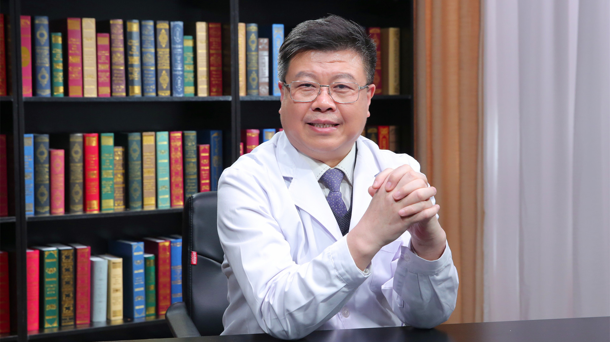

# 14.5 玻璃体视网膜手术

---

## 赵明威 主任医师

北京大学人民医院眼科主任 眼视光中心主任。

眼病与视光医学研究所所长 主任医师 医学博士 博士研究生导师；北京大学医学部眼视光学院院长；中华医学会眼科学分会第十一 十二届委员会常务委员兼副秘书长 专家会员 眼科学分会眼底病学组副组长；北京医学会眼科学分会副主任委员；中国医师协会眼科医师分会副会长；北京医师协会眼科分会副会长兼眼视光专业委员会主任委员；《中华眼底病杂志》副总编。

**主要成就：** 2006年获“北京地区百名优秀青年医师”称号；2014年全国眼科大会上获得中美眼科学会“金钥匙奖”以及首届“何氏眼科创新奖”的表彰；2016年获“中国优秀眼科医师”称号；2017年获第四届中央人民广播电台“京城好医生”称号；以第一或通讯作者发表中、英文论文50余篇；合作主编《视网膜色素上皮基础与临床》，主译《RETINA》第二分卷、《视网膜图谱》《眼外伤与眼科急症处理》；《眼底病学》第二版副主编，《玻璃体视网膜手术学》副主编。

**专业特长：** 近5年来在20G手法小切口玻璃体手术、光动力疗法（PDT）治疗中心性浆液性脉络膜视网膜病变（中浆）、新生血管性青光眼治疗策略的建立与推广等临床科研领域取得重要进展。

---
