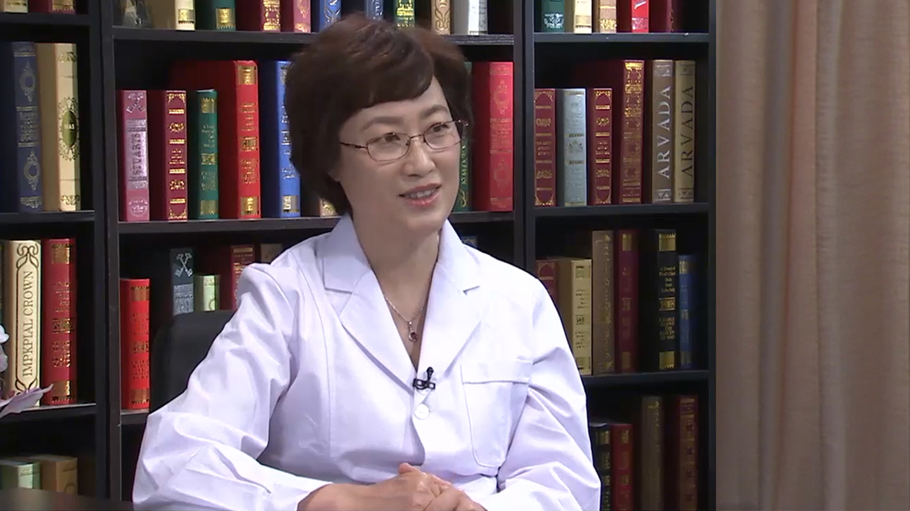

# 14.6 垂直斜视

---

## 李晓清 主任医师

北京大学第一医院小儿眼科主任 眼科中心副主任 主任医师 硕士研究生导师。

中华医学会眼科学分会斜视与小儿眼科学组委员；中国医师协会眼科医师分会斜视与小儿眼病专业委员会委员；中国女医师协会视光学专业委员会委员；国家自然科学基金评审专家；北京市自然科学基金评审专家；《中华眼视光学与视觉科学杂志》审稿专家。

**主要成就：** 2012年参与国家《0-6岁儿童残疾筛查技术规范》起草制订；2014年主持完成国家行业标准《儿童少年屈光检查要求》及《儿童少年弱视的诊断及疗效评价》修订项目；2015年参与中国残疾人联合会标准《政府购买0-6岁儿童残疾初筛、复筛、诊断服务》的制订工作；在国家大型专业会议及国家专业核心期刊发表学术论文20余篇。并参与编写眼科专著《现代眼科学》第3版。

**专业特长：** 专业方向为斜视，弱视，儿童屈光不正，婴幼儿视功能发育与相关儿童眼病。擅长复杂斜视处理，斜视显微手术，弱视综合治疗，儿童屈光不正矫治。专注于儿童视觉发育及相关眼病研究。

---
