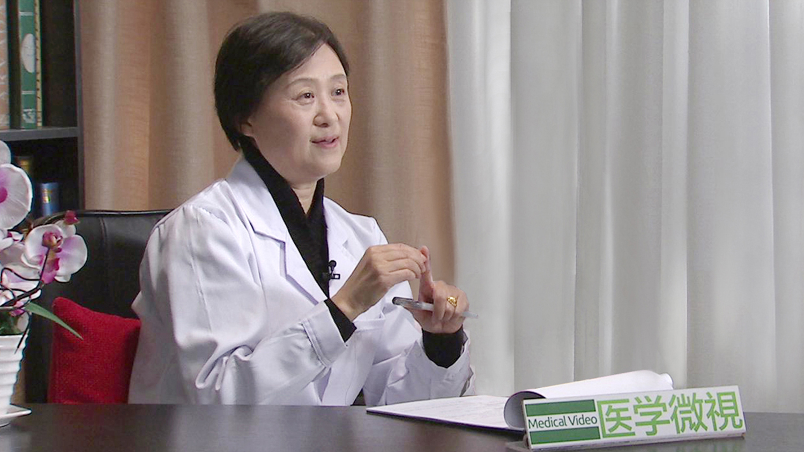

# 14.13 干眼症

---

## 王薇 主任医师

北京大学第三医院眼科主任 病理教研室主任。

曾任北京大学第三医院副院长；中国医师协会眼科医师分会副会长；中国女医师学会副主任委员；中华医学会眼科学分会白内障学组委员；中华眼科学会眼病理学组名誉组长。

**主要成就：** 从事白内障及老年性相关眼科的治疗，主持多项国家级、省部级科研项目。

**专业特长：** 擅长白内障及老年性相关眼病的诊治。

---
