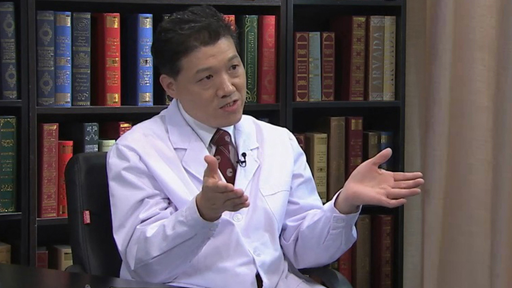

# 14.17 黄斑前膜

---

## 陈有信 主任医师

中国医学科学院眼科研究中心 北京协和医院眼科主任 博士生导师。

中华医学会眼科学分会常委兼秘书长；中国医师协会眼科分会原副会长；海峡两岸医药卫生交流协会眼科分会副主任委员兼黄斑学组组长；《中华眼科杂志》编委。

**主要成就：** 2004年获“中华眼科学会奖”；“泪液学临床及实验研究”获得国家科技进步二等奖；“肝细胞生长因子对RPE细胞的调节”获全国中青年眼科学术会议优秀论文一等奖；发表各类眼科学术文章20多篇；主编《视网膜色素上皮的基础与临床》；参编《眼底病学》《糖尿病眼部并发症及治疗》《老年黄斑变性基础与临床研究》等专著。

**专业特长：** 重点研究各种常见及疑难眼底病的诊治, 擅长糖尿病视网膜病变、视网膜脱离、黄斑裂孔、视网膜中央静脉阻塞、视网膜血管瘤样增生等眼底病的诊治。在脉络膜血管造影及疑难眼底病的诊治方面积累了丰富经验。

---
