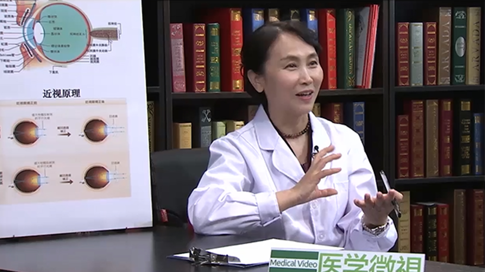

# 14.18 角膜炎

---

## 李莹 主任医师

北京协和医院角膜专业组组长 屈光手术中心主任 主任医师 教授 博士生导师。

中华医学会眼科分会角膜病学组副组长；中华医学会微循环眼科分会常务委员；中国医师协会眼科分会角膜病专业委员会副主任委员；亚洲干眼学会委员 。

**主要成就：** 发表论文近百篇，参加多部论著编写；2015年荣获我国眼科15年学术影响力排名专家榜，并列六强；《准分子激光角膜屈光手术治疗近视眼的临床研究》曾荣获卫生部科技进步成果奖；《LASIK手术后重症角膜感染和融解的抢救》《100例重症病毒性角膜炎的治疗与预防干预》《1000例SMILE手术治疗近视和散光的临床研究》分别荣获协和医院医疗科研成果奖；负责和参与包括多项国家和北京市自然科学基金，美国ARVO科研基金、教育部博士导师基金等。

**专业特长：** 在近视手术个性化设计、在感染性和非感染性角膜疾病和角膜屈光手术疑难并发症的诊治方面具有丰富经验，成功为几万例近视者进行了手术；作为全国“准分子激光治疗仪使用人员上岗资格考试”培训专家，几年来为推动我国准分子激光角膜手术的规范化发展做出了很大的贡献。

---
