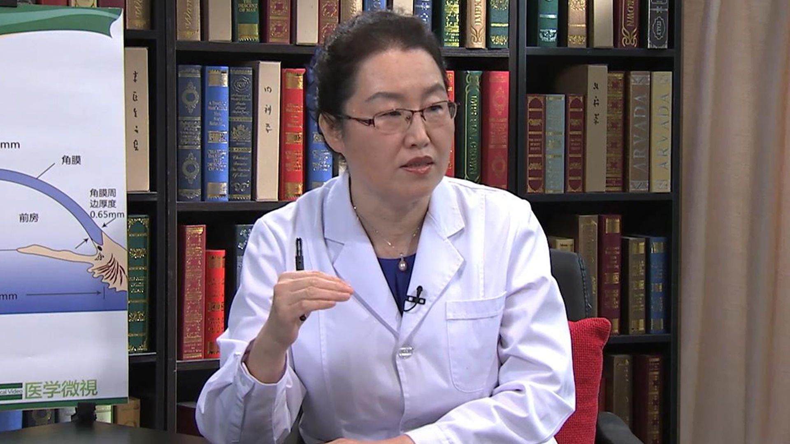

# 14.19 角膜移植

---

## 洪晶 主任医师

北京大学第三医院眼科中心副主任 角膜眼表疾病科主任 眼库主任 主任医师 博士生导师。

中华眼科学会角膜病学组委员；中华医学会组织工程干细胞学组委员；《中华眼科杂志》编委；《实用器官移植杂志》编委。

**主要成就：** 获省科技进步二等奖一项；承担国家及省部级课题十余项；在国内外发表文章100余篇。

**专业特长：** 从事角膜及眼表疾病的临床研究20余年，对复杂角膜病的诊疗；结膜炎和干眼病的基础研究和临床诊治有较深的造诣；擅长各种类型角膜移植手术；在国内率先开展角膜内皮移植手术，推动了中国角膜移植手术的发展。

---
