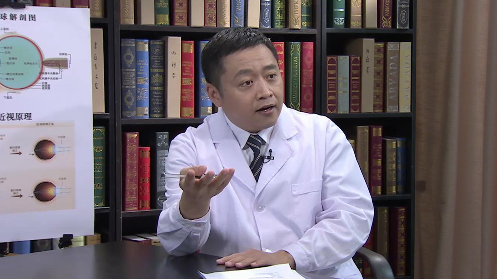

# 14.20 可植入式隐形眼镜

---

## 翟长斌 主任医师

首都医科大学附属北京同仁医院屈光科主任医师。

中华医学会激光学会委员；中国医药教育协会眼科专业委员会委员；北京中西医结合学会眼科学会委员；首都医科大学眼科学博士；美国印第安纳大学视光学院医学博士后。

**主要成就：** 1993年获《美国医学会眼科杂志》中文版翻译二等奖；1998年8月在第一届世界华人眼科大会上获得青年优秀论文奖；2003年参与完成的《多种免疫抑制剂对角膜移植免疫排斥治疗的研究》获北京市科技进步三等奖；在国内外发表论文数十篇，被美国国立卫生研究院收录多篇。

**专业特长：** 擅长近视眼治疗、飞秒激光、LASIK手术、波前像差LASIK手术及其它多种眼科疾病的治疗。在临床工作中，完成大量的准分子激光角膜屈光手术，具有丰富的临床经验。

---
