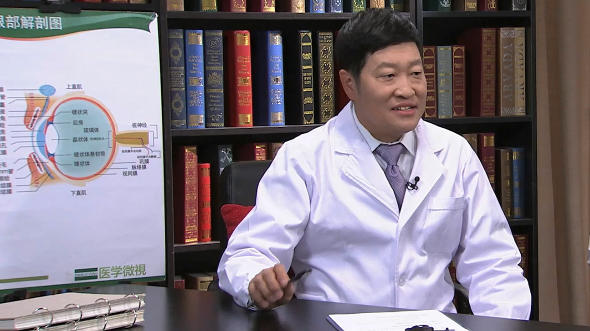

# 14.21 老花眼

---

## 朱思泉 主任医师

首都医科大学附属北京安贞医院眼科中心主任 主任医师 首席专家 教授 博士生导师。

首都医科大学眼科学院副院长；成都中医药大学附属眼科医院常务副院长；中国医疗保健国际交流促进会眼科分会副主任委员兼秘书长；中国医疗保健国际交流促进会常务委员；中国医师协会眼科学分会白内障学组委员；中华医学会眼科学分会委员；四川省医学会常务委员。

**主要成就：** 原中央保健局一级保健专家，中国航天员保健专家，四川省千人计划特聘专家，入选中国名医百强榜；主持国家自然基金6项，获专利20项； 发表论文170余篇，SCI论文82篇，主编专著3部；2016年获高等学校科学研究优秀成果奖二等奖，2020年获国家发明奖二等奖。

**专业擅长：** 擅长先天性白内障遗传基础及发病机制研究、智能微创白内障手术系统研究、适合人眼的功能性人工晶体材料研究、失重状态下视功能的损伤与机制研究、复杂类型白内障手术体系的建立；已完成各种类型白内障手术30余万例，独创了老花眼和近视眼的防控体系，率先开展了矫正老花眼、生理性近视矫正等一系列新技术，并提出了相应的手术指征，取得了100%的临床效果。

---
