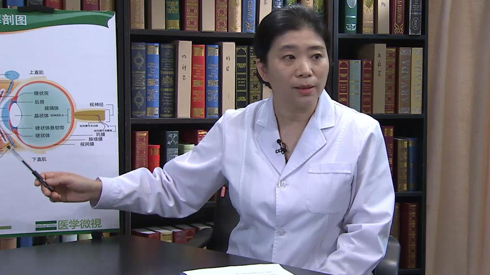

# 14.26 弱视

---

## 杨素红 主任医师

首都儿科研究所附属儿童医院眼科主任 主任医师。

中华预防医学会儿童保健分会视觉保健学组副组长；中国健康教育促进协会《护眼健康教育工程》青少年防控近视专家组成员；《中国斜视与小儿眼科杂志》副主编。

**主要成就：** 在国内外重要学术刊物和国际会议上发表学术论文20余篇。

**专业特长：** 擅长各类复杂斜视、弱视、儿童屈光不正，包括青少年近视及各种儿童眼病的诊断与治疗；擅长斜视、上睑下垂及儿童泪道手术；成功完成各类水平斜视、垂直斜视、上睑下垂矫正手术、泪道疏通、复杂泪道置管术及眼睑成形术近万例，对于复杂疑难的二次斜视手术也有丰富的经验。

---
