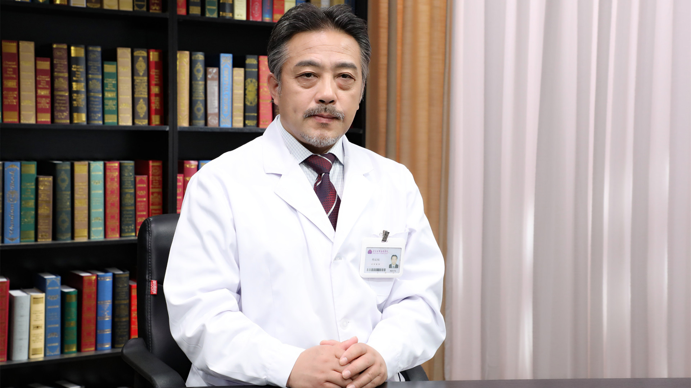

# 14.27 视网膜静脉阻塞

---

## 胡运韬 主任医师

清华大学附属北京清华长庚医院眼科主任 主任医师 医学博士 教授。

中华医学会眼科学分会眼外伤学组副组长；中国医师协会眼科医师分会眼外伤专业委员会副主任委员；中国残疾人康复协会视力残疾康复专业委员会副主任委员；北京医学会眼科学分会常务委员；美国南加州大学生物医学治疗研究所客座教授；《中华眼外伤职业眼病杂志》编委。

**主要成就：** 在国内外发表论文60余篇，参编著作6部，多次应邀国际会议发言；致力于眼底病、眼外伤的临床研究和手术技术改进与设备研发，专研眼底病干细胞移植、基因治疗技术、人工电子视网膜和人工智能应用；获得多项国家级及省部级项目支持；2017年获中华眼科学会奖；2018年获中国医师协会眼科好医生奖。

**专业特长：** 擅长眼科疑难杂症的诊治，对眼底病、复杂眼外伤救治、白内障及玻璃体视网膜显微手术具有丰富的临床经验，尤其擅长手术方法和手术工具的改进和研发。

---
