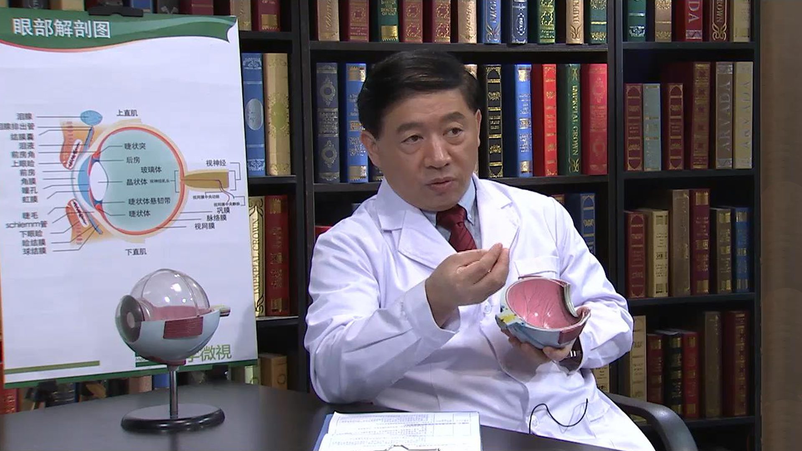

# 14.28 视网膜脱落

---

## 戴虹 主任医师

北京医院眼科主任 主任医师 研究生导师 教授。

中华医学会眼科学会常委；中华医学会眼科学会眼底病学组委员；中国医药教育协会眼科专业委员会常委；中囯中药协会药物临床评价研究专业委员会常委；北京医师协会眼科专科分会常务理事；中国微循环学会眼科分会常委。

**主要成就：** 在国内率先开展黄斑变性的早期诊断与视功能监测，开展黄斑转位手术、自体细胞移植、光动力疗法治疗黄斑变性等工作，在国际上同期开展抗血管生成药治疗黄斑变性及其它疾病的应用，成为国内首位开展和目前治疗病例数最多的医生。

**专业特长：** 擅长视网膜脱离、眼外伤、糖尿病视网膜病变、黄斑裂孔、黄斑区增殖膜等手术。

---
