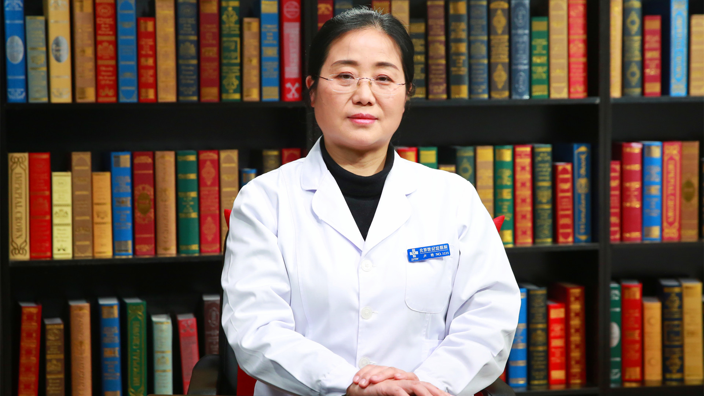

# 14.36 眼科症状-异物感

---

## 卢艳

首都医科大学附属北京世纪坛医院眼科主任 主任医师 硕士生导师。

中华医学会眼科学分会神经眼科学组委员；中国医师协会眼科医师分会青光眼委员会委员；北京医师协会眼科专科医师分会理事；北京医师协会眼科专科医师分会青光眼委员会副主任委员；北京医师协会眼科专科医师分会神经眼科委员会副主任委员。

**学术成就：** 先后承担和参与国家973、十二五、国家自然科学基金、北京市自然科学基金以及北京市科委等多项课题研究；发表核心期刊和SCI论文40余篇；先后获得北京市科技进步二等奖、河北省邯郸市科技进步一等奖，并入选北京十百千卫生人才工程。

**专业特长：** 擅长各种白内障手术，青光眼白内障联合手术，青光眼微创手术、飞蚊症激光治疗、眼底病激光治疗。

---
