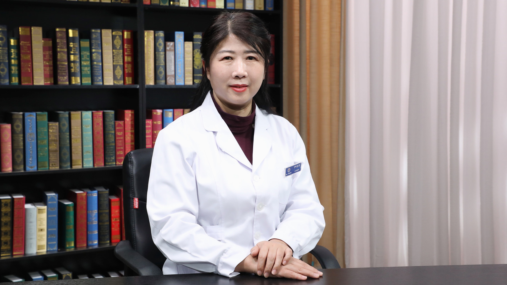

# 14.44 中西医结合治疗高度近视

---

## 尹连荣 主任医师

中国中医科学院眼科医院屈光手术科主任 主任医师 知名专家 医学博士 眼科博士后 博士生导师。

中国医师协会中西医结合医师分会眼科专业委员会副主任委员兼秘书长；中华中医药学会眼科分会常务委员；世界中医药学会联合会眼科专业委员会常务理事；北京医师协会眼科专科医师分会常务理事。

**主要成就：** 中国中医科学院眼科医院中青年名中医、手术师承导师；主持各类课题10余项；在专业核心期刊发表论文60余篇。

**专业特长：** 从事眼科临床工作28年，擅长近视、远视、散光、老视的手术治疗，白内障的个体化手术治疗，高度近视性视网膜病变的中西医结合治疗，青少年近视防控。

---
