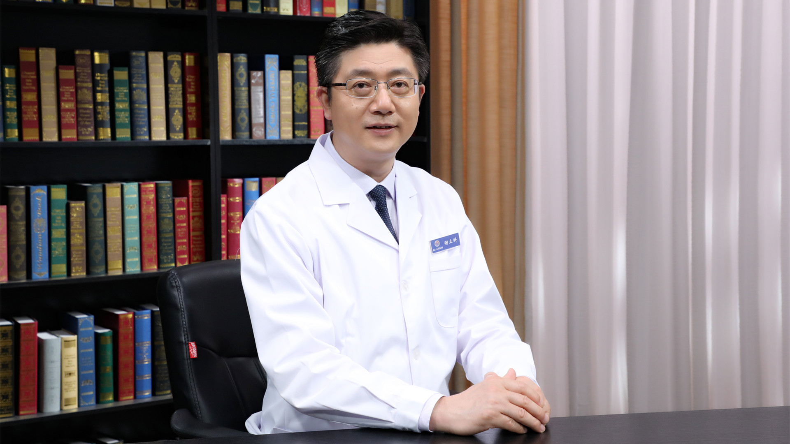

# 14.45 中西医结合治疗眼眶炎性假瘤

---

## 谢立科 主任医师

中国中医科学院眼科医院副院长 主任医师 教授 博士生导师 首都名中医。

世界中医药学会联合会眼科专业委员会会长；全国中医药创新骨干人才导师；美国南加州大学访问学者；享受国务院特殊津贴专家；全国中医眼科医联体总负责人；国家自然科学基金评审专家；教育部硕 博士论文函审专家；中国中医药循证医学中心视网膜静脉阻塞项目负责人。

**主要成就：** 多年来主持各类课题近20项，参与课题20余项；获中国民族医药学会科技进步一等奖、中国中西医结合学会科技进步奖二等奖等共8项；主编、副主编、编著著作10余本，参编近20本；在SCI及核心期刊及眼科专业杂志发表学术论文180余篇，专利5项；在《健康报》《人民日报健康时报》《中国中医药报》等国家及省级报刊发表科普论文300余篇；2008年被中国中医药学会评为“全国优秀中医健康信使”；2010年中国中医药学会评为“全国科普金话筒奖”；2015年领导的团队获得“国家五一劳动奖状”。

**专业特长：** 从事中医、中西医结合眼科临床、科研及教学工作33年；擅长眼科显微外科手术及中西医结合治疗眼科疑难病。重点研究视网膜血管阻塞、玻璃体疾病，黄斑疾病及玻璃体手术后视功能恢复。

---
