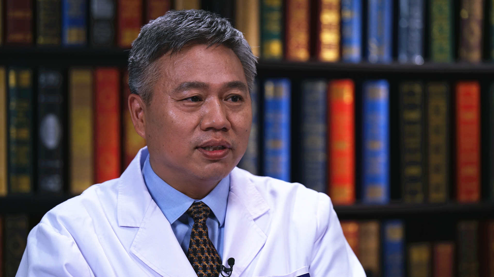

# 14.46 中医治疗青光眼

---

## 冯俊 主任医师

中国中医科学院眼科医院眼二科主任 主任医师 博士生导师。

世界中医药学会联合会眼科专业委员会副会长；中国中西药研究促进会眼科分会副会长；中国中西医结合学会眼科专业委员会常委；中国中药协会眼保健中医药技术专业委员会常委；中华中医药学会眼科分会常委。

**主要成就： **获北京市科技进步奖、中华中医药学会科技奖等5项；改良青光眼小梁切除手术，首倡剔络养血辨证论治青光眼视功能保护康复治疗，首创剔络化瘀法治疗眼底出血性血管病、剔络养血法治疗眼缺血性血管病，首创白内障冯氏劈核钩及劈核术；撰写发表论文20余篇，主编及参编著作9部，承担课题15项。

**专业特长：** 擅长于中医、中西医结合个体化方案治疗中老年常见、疑难眼病；手术治疗青光眼、白内障。秉承中医经典与国医大师思想，以纯正中医思维辨证治疗视网膜静脉阻塞、PCV、青光眼、黄斑水肿、黄斑出血、黄斑变性、缺血性视神经病变等眼底出血及缺血性疾病。

---
