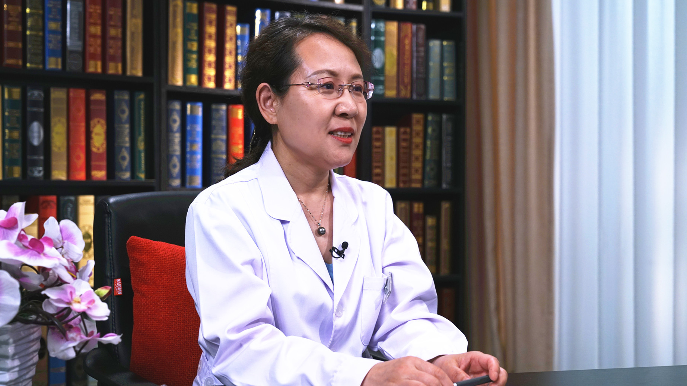

# 14.46 中医治疗糖尿病视网膜病变

---

## 接传红 主任医师

中国中医科学院眼科医院糖尿病眼病科（眼一科）主任 主任医师 博士生导师。

中医眼科学科带头人；中华中医药学会眼科分会副主任委员；中华中医药学会糖尿病分会委员；中国中药协会眼保健中医药技术专业委员会副主任委员；北京中医药学会眼科专业委员会主任委员；世界中医药学会联合会眼科专业委员会理事；《中国中医眼科杂志》编委；《北京中医药杂志》编委。

**主要成就：** 获得北京市中青年名中医称号，北京市首批健康科普专家；主持承担和主要参与国家科技部、北京市重点攻关等项目13项，有关糖尿病视网膜病变课题获得北京市、中华中医药学会等科技进步奖5项；研究成果“密蒙花方”成为首批北京市“十病十方”，用于治疗糖尿病视网膜病变；在国家级杂志发表论文80余篇，编写著作15部。

**专业特长：** 擅长中西医结合治疗眼科常见病、疑难病，如糖尿病视网膜病变、黄斑水肿、视神经病变、视网膜静脉阻塞、干眼、新生血管性青光眼、青少年近视、弱视防治等；在各种激光技术治疗眼底病、后发性白内障、青光眼方面经验丰富。

---
