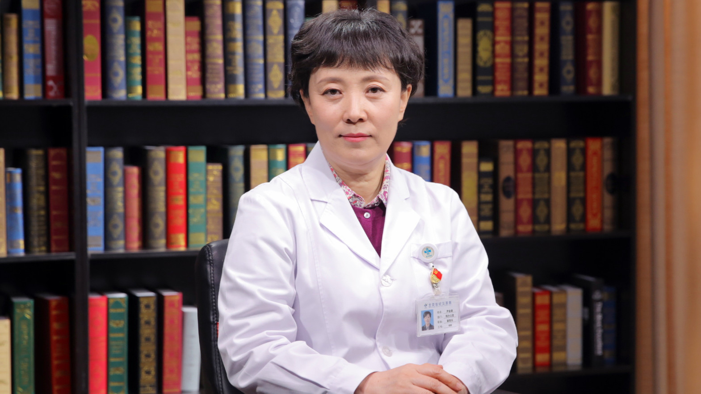

# 15.8 鼻出血

---

## 尹金淑 主任医师

首都医科大学附属北京世纪坛医院副院长 主任医师 医学硕士 博士生导师。

中国医师协会耳鼻咽喉头颈外科分会常务委员；中国医师协会毕业后医学教育耳鼻咽喉专业委员会常务委员；中国医疗保健国际交流促进会耳鼻咽喉委员会常务委员；北京医学会耳鼻咽喉头颈外科学分会常务委员；北京医学会变态反应分会常务委员。

**主要成就：** 获得省部级科研课题10项，研究经费300余万元；发表专业论文50余篇，参编学术专著4部，参译1部。

**专业特长：** 致力于鼻科疾病的临床及相关基础研究，擅长鼻内镜技术。对慢性鼻窦炎、变应性鼻炎及其并发症、鼻源性头痛有较系统的研究。对阻塞性睡眠呼吸暂停低通气综合征、嗓音异常、喉癌的诊断与治疗积累了丰富经验。

---
