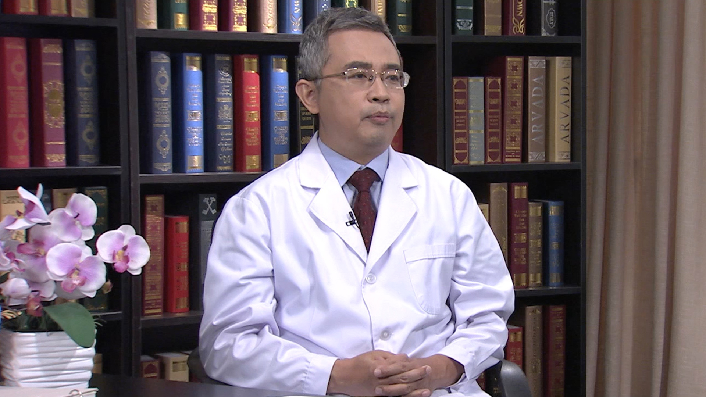

# 15.9 鼻窦炎/咽炎/扁桃体炎

---

## 王旻 主任医师

北京大学人民医院主任医师 硕士生导师；中国人体健康科技促进会鼻科专业委员会秘书长。

中国人体健康科技促进会儿童变态反应专业委员会副主任委员；中华医学会耳鼻喉分会鼻科学组委员；中国医师协会耳鼻喉分会鼻科学组委员；中国医师协会内镜分会委员；中国医促会耳鼻喉分会委员；中西医结合学会鼻颅底肿瘤及嗅觉专业委员会常务委员；《中华耳鼻咽喉头颈外科杂志》通讯编委；《中国耳鼻咽喉颅底外科杂志》编委；《中华耳鼻咽喉头颈外科杂志》编委。

**主要成就及论文编著：** 先后获得“985”多项科研基金资助，参加“十一五科技公关课题”等研究项目；参与编写了《耳鼻咽喉科诊断学》《耳鼻咽喉临床医学问答》《听医学专家讲述耳鼻咽喉科学—社区保健丛书》，参加翻译《额窦》；在Human Genetics（影响因子 4.3，引用94次）等著明杂志发表了鼻科论文十余篇。

**专业特长 ：** 擅长对鼻科疾病的诊断治疗，熟练掌握了各种复杂鼻内镜手术技术，对于各种类型的鼻窦炎、鼻息肉、鼻中隔偏曲、腺样体肥大、内翻性乳头状瘤、血管瘤等鼻腔鼻窦良恶性肿瘤，脑脊液鼻漏修补、脑膜脑膨出、鼻腔泪囊吻合等鼻颅鼻眼相关的手术治疗以及对变应性鼻炎的诊断和脱敏治疗有着丰富的经验。

---
