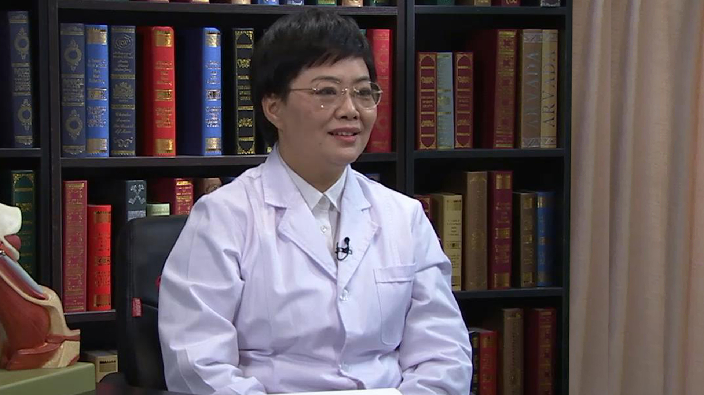

# 15.11 胆脂瘤

---

## 马芙蓉 主任医师

北京大学第三医院耳鼻咽喉头颈外科主任 主任医师 博士生导师。

世界卫生组织防聋合作中心常委；中华医学会耳鼻咽喉头颈外科分会委员；中国医师协会耳鼻咽喉科分会副会长；北京医学会耳鼻咽喉头颈外科学分会副主任委员。

**主要成就：** 2016年荣获“北京大学优秀共产党员”称号；中国医师协会人文医学分会“人文医生奖”；带领的团队获得“人文科室”；北京市海淀区政协委员；承担着国家自然科学基金重大研究计划子课题、国家自然科学基金面上项目、北京市自然科学基金、科技部十一五科技支撑计划子课题及首都科学发展基金子课题；发表论文六十余篇；编写专著《颞骨解剖与手术径路》。

**专业特长：** 擅长耳科疾病的诊治。具有闲熟的耳显微外科手术技巧，除能高质量完成常见的耳科手术外，主要致力于乳突根治手术后解剖的重建和听力的重建、内淋巴囊手术、面神经的减压及重建手术、人工耳蜗及耳颅底外科。

---
