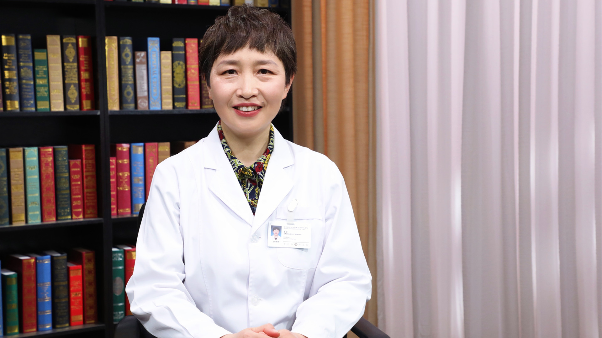

# 15.12 声音嘶哑

## 徐文 主任医师

首都医科大学附属北京同仁医院耳鼻咽喉头颈外科-咽喉科主任 主任医师 教授 博士生导师。

中华医学会耳鼻咽喉头颈外科学分会咽喉学组副组长；中国医师协会耳鼻咽喉科医师分会咽喉学组副组长；国际嗓音协会大中国区常务副主席；国际言语和嗓音学会（IALP）委员；中国艺术医学会嗓音专业委员会副主任委员；中国医疗保健国际交流促进会胃食管反流多学科分会副主任委员；美国嗓音医学杂志 *Journal of Voice *编委。

**主要成就：** 出版学术著作24部，其中主编4部（英文1部），副主编3部，包括《嗓音医学》（第1版、第2版）《频闪喉镜临床应用-咽喉疾病视频图谱》《康复治疗师临床工作指南-嗓音障碍康复治疗技术》等，参编17部（英文2部）。

**专业特长：** 主要从事咽喉科疾病及嗓音疾病临床诊治及相应基础研究。

---
