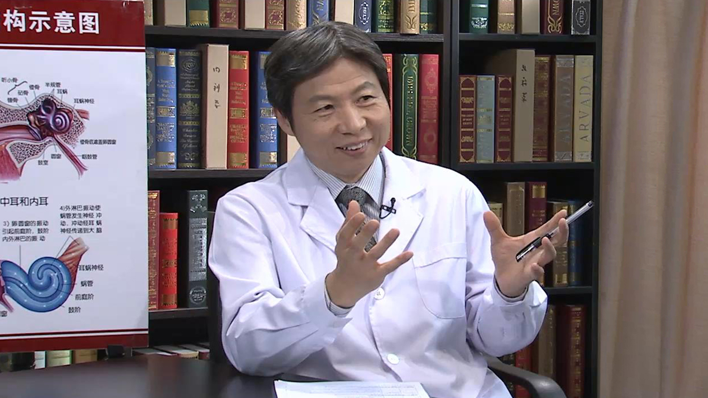

# 15.24 耳石症

---

## 王宁宇 主任医师

首都医科大学附属北京朝阳医院耳鼻咽喉头颈外科主任 主任医师 首都医科大学耳鼻喉学院副院长 博士研究生导师。

中华医学会耳鼻咽喉头颈外科分会全国委员；中国中西医结合学会副主任委员；北京医学会眩晕医学分会副主任委员；北京医学会过敏变态反应学分会常务委员；世界卫生组织全球防聋合作中心专家委员。

**主要成就：** 发表论文110篇，主编专著5部，参编专著17部；获专利8项，承担科研课题22项，在研课题3项，其中国家自然科学基金1项；北京市级重点科研课题2项，科研经费达300万元；培养博士、硕士研究生33名。

**专业特长：** 从事临床及科研工作30余年，擅长人工耳蜗植入术、人工听骨植入术、中耳胆脂瘤、镫骨手术、听力重建术、面瘫面神经减压术、耳硬化症手术、鼓室体瘤切除术、面神经肿瘤切除术、脑脊液耳漏修补术等。

---
