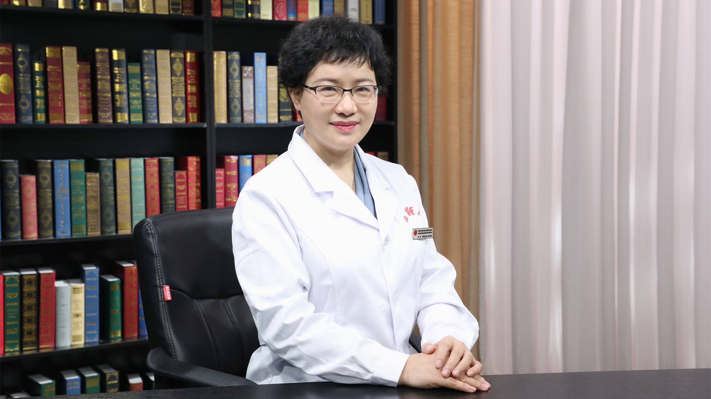

# 15.28 儿童腺样体肥大的中西医结合治疗

---

## 刘静 主任医师

中国中医科学院西苑医院耳鼻喉科主任 主任医师 教授 硕士生导师。

中华中医药学会耳鼻喉科分会副主任委员；中国中药协会耳鼻咽喉药物研究专业委员会副主任委员；世界中医药学会联合会耳鼻喉口腔科专业委员会副会长；北京中西医结合学会耳鼻喉分会副主任委员。

**主要成就：** 中国中医科学院中青年名中医；承担、参加各级课题30余项；发表论文40余篇，主编、参编著作20余部。

**专业特长：** 擅长以中医为主、中西医结合为辅，针药结合等方法防治耳鼻喉科疾病。

---
