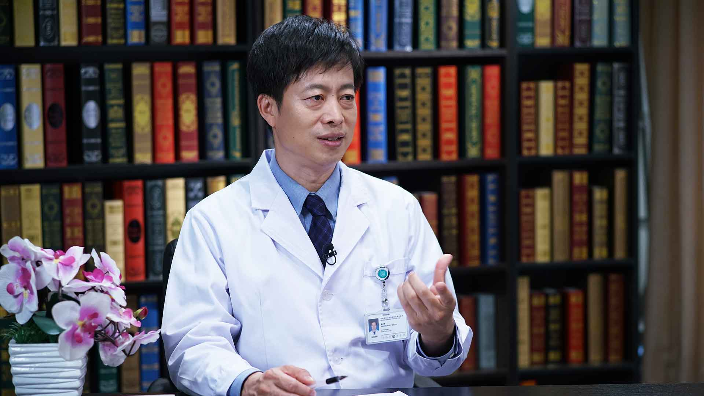

# 15.29 耳硬化症

---

## 李永新 主任医师

首都医科大学附属北京同仁医院耳科主任 主任医师 医学博士 博士生导师。

中华医学会耳鼻咽喉科学分会耳科学组副组长；中国医师学会耳科学组副组长；中国残联听力言语康复委员会副主任委员；中国中西医结合学会耳聋专家委员会副主任；国家及北京市自然科学基金评审专家；北京市高级卫生人才“百”层次；《中华耳鼻咽喉头颈外科杂志》编委。

**主要成就：** 发表SCI论文20余篇，学术论著100余篇；副主编专著1部，主译专著1部，参编专著书籍15部；主持国家自然科学基金5项、市级研究课题多项，研究荣获国家技术进步奖、北京市科技进步奖，截至2018年底共获批国家实用新型专利6项。

**专业特长：** 长期从事于耳科学及耳外科学的临床和基础研究，擅长疑难人工耳蜗植入手术、各种听力重建手术、眩晕外科手术、侧颅底肿瘤等手术。

---
