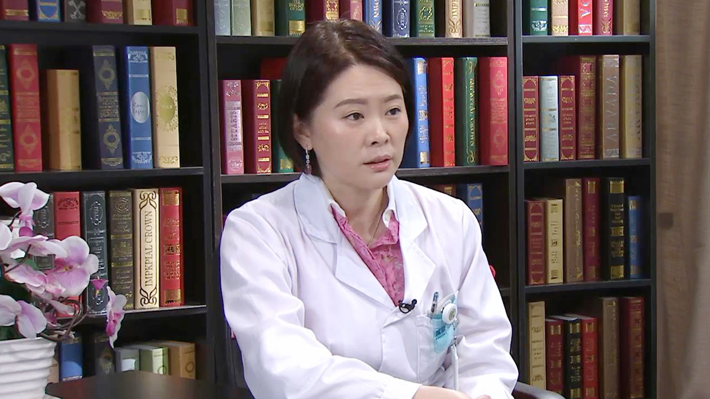

# 15.40 人工耳蜗植入//李原教授

---

## 李原 主任医师

中日友好医院耳鼻喉科主任医师。

中国残疾人康复协会听力语言康复专业委员会副主任委员；北京医学会眩晕医学分会第一届常务委员；《听力学与言语疾病杂志》编委；《中国听力语言康复科学杂志》编委

**主要成就及论文编著：** 2007年开始成为卫计委、中国残联“听力重建 启聪行动”项目及“国家贫困聋儿人工耳蜗抢救性康复项目”定点医院手术负责人；2010年、2011年两次获得卫生部、中国残联通报表扬；在医学核心期刊发表学术论文20余篇，参编《中国耳鼻咽喉头颈外科》等医学著作3部。

**专业特长：** 擅长耳鼻咽喉疾病的诊治，自2001年始开展多通道人工耳蜗植入手术。具有娴熟的耳显微外科和耳神经外科手术技巧，能熟练并高质量地完成耳科手术及侧颅底手术，如人工耳蜗植入术、听觉中耳植入、乳突根治术及术后听力重建、岩尖胆脂瘤切除术、颞骨恶性肿瘤根治手术、面神经减压术及重建术，内淋巴囊减压术等**。**

---
