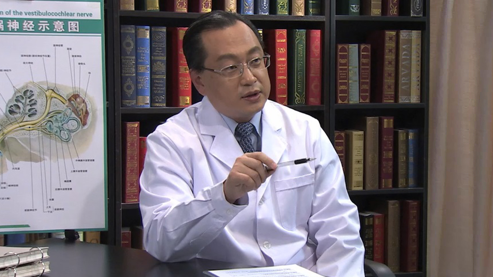

# 15.45 听神经瘤

---

## 贾旺 主任医师

首都医科大学附属北京天坛医院神经外科主任医师。

中华医学会神经外科分会中青年委员会全国委员；中国医师协会神经外科分会中青年医师委员会副主任委员；中国医师协会神经外科分会医师定期考核编辑委员会秘书长；中国医师协会神经外科医师分会北京地区专家委员会委员兼秘书；中华中青年神经外科医师联谊会副会长；北京医学会神经外科分会中青年委员会副主任委员。

**主要成就：** 近年来共主编专业书籍“显微神经外科解剖学图谱”一部；参加编写专业书籍3部，核心期刊发表第一作者论著20余篇，SCI收录9篇；承担科研项目9项，；获得北京市科技进步三等奖一项，中华医学科技奖三等奖2项，中华医学科技奖二等奖一项。

**专业特长：** 擅长颅底肿瘤的生物学特性和综合治疗，专业方向为颅内肿瘤的综合治疗研究。共参加各类手术4000例以上，并在垂体肿瘤、听神经瘤的临床治疗和中枢神经系统的应用解剖研究及培训上取得了很好的成绩。

---
