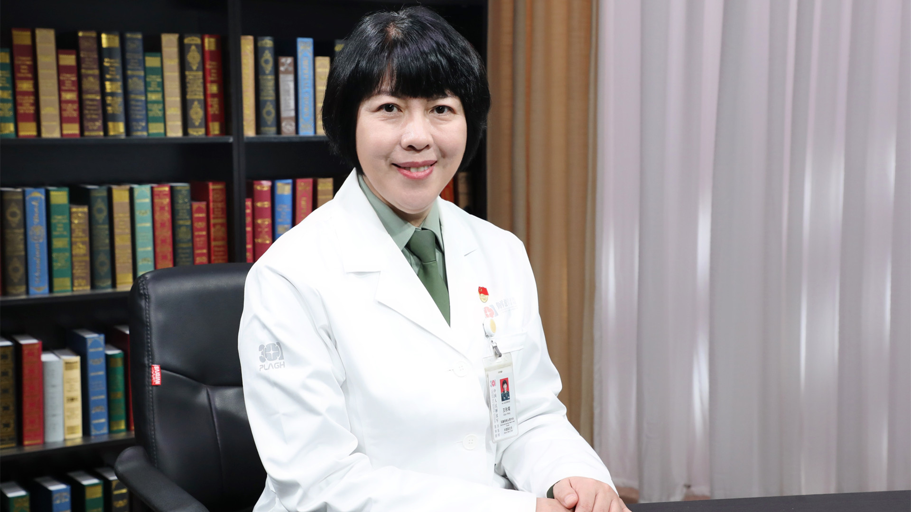

# 15.56 遗传性耳聋

---

## 王秋菊 主任医师

中国人民解放军总医院耳鼻咽喉头颈外科行政副主任  耳鼻咽喉研究所所长  主任医师 博士生导师。

国际耳内科医师协会（IAPA）主席；中华医学会耳鼻咽喉头颈外科学分会耳科学组副组长；中国医师协会耳鼻咽喉科医师分会耳内科学组组长；中国医疗保健国际交流促进会耳内科分会主任委员。

**主要成就：** 《中华耳科学杂志》执行主编；创立我国耳内科学，发现国际唯一被证实的Y连锁遗传性耳聋，提出新生儿听力基因联合筛查新模式，完成我国首例重度遗传性耳聋第三代试管婴儿；主持国家“863”“973”计划、国家自然科学基金及国际合作基金等重点课题；获国家科技进步二等奖、中华医学科技进步一等奖、北京市科技进步二等奖等4项，获国家发明专利30项；发表论文300余篇，SCI收录70余篇。

**专业特长：** 擅长聋病遗传咨询、耳聋耳鸣的内科诊治等临床工作；侧重聋病分子遗传学及临床转化应用的基础研究。

---
