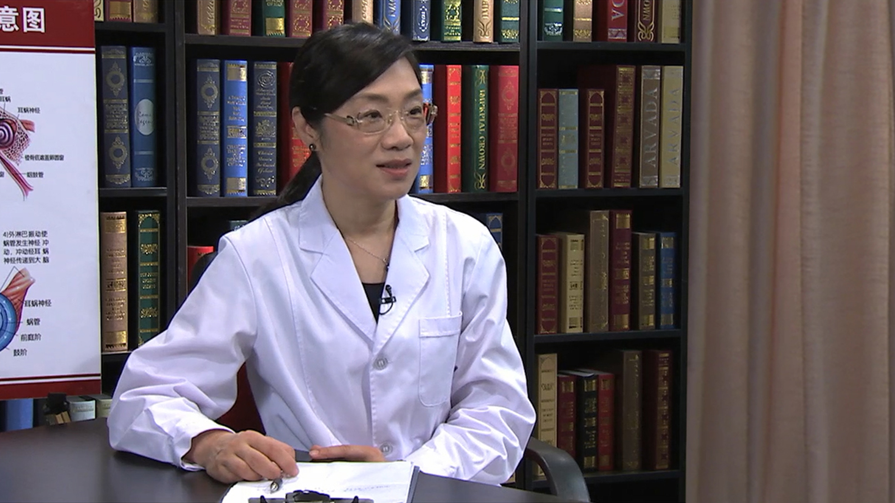

# 15.57 中耳炎

---

## 王军 主任医师

北京大学第一医院耳鼻咽喉头颈外科主任医师 硕士研究生导师。

中国中西医结合学会耳鼻喉科分会委员；中国中西医结合学会眩晕病专业委员会委员。

**主要成就：** 承担了中华医学会临床医学科研专项资金项目《中国突发性聋多中心临床研究》的课题研究工作；荣获北京大学颁发的优秀临床医师奖和优秀教师奖；总结撰写专业文章，在《中国科技论文统计源期刊》发表论文10余篇；参加专业教科书的编写工作。

**专业特长：** 擅长疑难疾病的诊断治疗，主要致力于乳突根治手术后解剖和听力的重建；人工听小骨植入术；人工耳蜗手术及耳颅底外科；擅长耳聋、耳鸣的诊断及治疗，如突发性耳聋的标准化的诊断、分型治疗和难治性突发性耳聋的挽救性治疗，治疗急性和慢性耳鸣，以及耳鸣的习服治疗。

---
