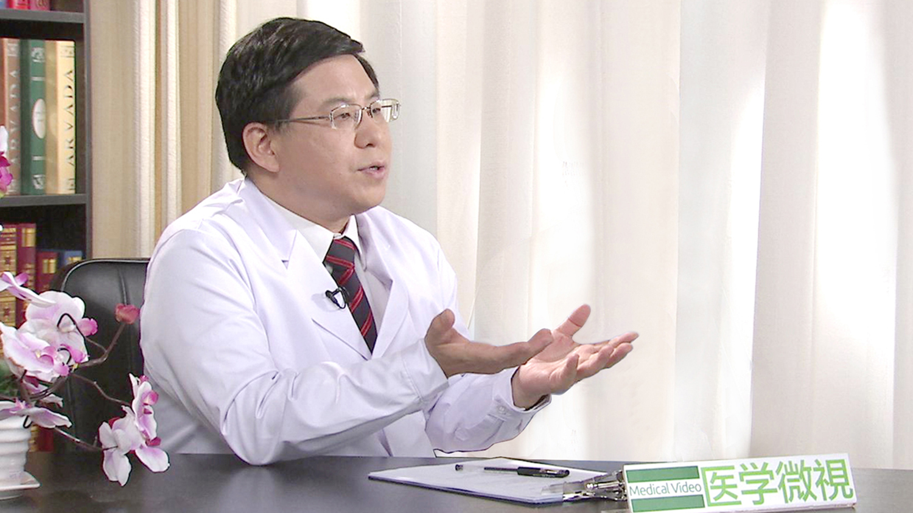

# 16.1 勃起功能障碍（ED）

---

## 姜辉 主任医师

北京大学第一医院党委书记 泌尿外科知名专家（原北京大学第三医院男科中心主任）。

北京大学医学部性学研究中心常务副主任 学术委员会主任 主任医师 教授 博士生导师；美国德克萨斯大学休斯顿医学中心客座教授；中国性学会常务副理事长兼秘书长；中华医学会男科学分会主任委员；中国卫生政促会医学教育分会副会长；吴阶平医学基金会男性生殖学部主任；北京医学会男科学分会主任委员；北京健康教育协会性生殖健康教育专委会主任委员；北京医学会生殖医学分会委员；北京市计划生育协会常务理事；北京医学教育协会常务理事；北京市首批健康科普专家；《中华男科学杂志》名誉主编 ；《中国性科学》杂志社常务副社长兼副主编；《Asian Journal of Andrology》编委；《中国男科学杂志》编委；《中国计划生育学杂志》常务编委；《转化医学(电子)杂志》编委。

**主要成就：** 参与编辑出版《我们的性》《健康男性知多少》《夜问36》《男人枕边书》等科普刊物；特别是由其主编的男性健康科普书籍《夜问36》、《男人枕边书》、《排忧解男题》等出版印刷近百万册，深受读者欢迎；先后获评首届 “十大男性健康科普专家“；”2014年第七届健康中国论坛“十大健康年度人物”奖；百度健康 2014 年“健康权威奖”；因其在推动中国男科学发展及推广男性健康大众教育方面的突出表现，2014年10月全球华人泌尿外科学会授予其“杰出贡献奖”。

**专业特长：** 擅长男性泌尿系统疾病的诊治。长期从事泌尿男科、生殖医学的临床和科研教学工作，特别是在男性不育、性功能障碍、前列腺疾病、男性更年期和男性生殖健康教育等方面有较高的造诣和丰富的临床经验。

---
