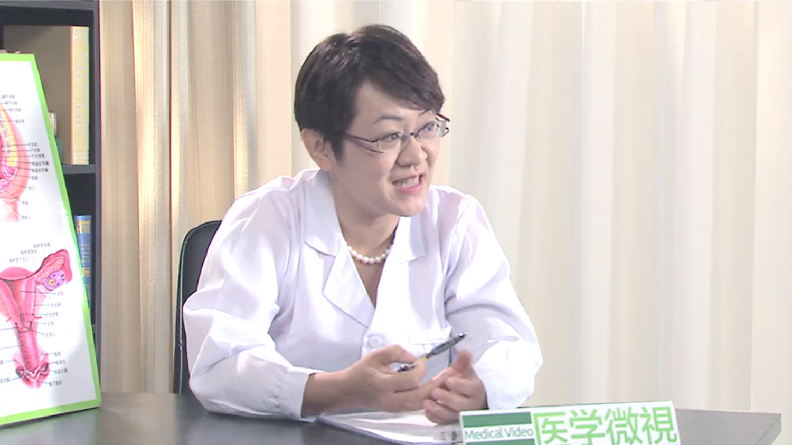

# 16.9 女性不孕症

---

## 李媛 主任医师

首都医科大学附属北京朝阳医院生殖医学中心主任 主任医师 教授 博士生导师.

中华医学会妇产科学会内分泌学组委员兼秘书；中华医学会生殖医学分会第一届、第二届青年委员会委员；中国国家人类辅助生殖技术评审专家库专家；海峡两岸医药卫生交流协会遗传与生殖专业委员会常委；北京市医学会药理委员会生殖药理专业委员会委员；山东省医学会生殖医学分会副主任委员；北京市卫生系统“215”高层次卫生技术人才队伍建设工程妇产科学科带头人；北京市第十三届妇女代表大会代表；《现代妇产科进展》杂志编委会委员；《中华男科学杂志》编委会委员；《International Journal of Gynecology & Obstetrics》审稿专家；《Fertility & Sterility》审稿专家。

**主要成就：** 1、 “卵巢功能异常-PCOS和POF分子遗传机理及治疗新技术的建立和应用”国家科技进步奖二等奖2009年12月（第2位） 2、 教育部“新世纪优秀人才” 2010年 3、 北京市卫生系统“215”高层次卫生技术人才队伍建设工程妇产科学科带头人，2013年 4、 “多囊卵巢综合征辅助生殖基础与临床系列研究” 教育部提名国家科技进步奖（一等）2005年1月（第2位） 5、 “人类未成熟卵母细胞体外成熟培养及生物学机制研究”山东省高等学校优秀科研成果奖自然科学类一等奖2006年12月（第1位） 6、 “多囊卵巢综合征辅助生殖基础与临床系列研究”中华医学奖二等奖2008年12月（第2位） 7、 “人类卵母细胞体外成熟与多囊卵巢综合征临床与基础系列研究”山东省科技进步奖二等奖2005年7月（第2位） 8、 “多囊卵巢综合征辅助生殖基础与临床系列研究”山东省医学科技进步奖（一等）2004年（第2位） 9、 “人类生殖与辅助生殖”山东省医学科技成果推广应用奖三等奖2007年（第3位） 10、 “联合培养与助孕技术的相关研究”山东省医学科技创新成果奖（三等）2005年9月（第6位）。 11、 “人类辅助生育系列技术” 1999年山东省十大科技成果奖（第5位）； 12、 “人类辅助生育技术及其临床应用系列研究” 山东省科技进步奖（一等）2000年（第5位）。 13、 “黄素化不破裂卵泡综合征病因与诊治临床研究”山东省医药卫生科技进步奖 （二等）1999年（第3位） 14、 中国科学技术信息研究所第一届“中国百篇最具影响优秀国际学术论文”（2007.11） 15、 第一届和第五届山东大学青年教学能手（2003年，2010年） 16、 山东大学医学院第三届优秀青年教师（2007年） 17、 山东大学教学比赛一等奖（2010年） 18、 培养的硕士研究生于2010年获得山东大学优秀研究生奖学金；获得专利情况： 1. 一种玻璃化冷冻低温冷冻槽，国家实用新型专利（ZL 2008 2 0016564.4） 2. 一种玻璃化冷冻细胞承载器，国家实用新型专利（ZL 2008 2 0016565.9） 3. 人卵母细胞序列玻璃化冷冻液和融解液 国家发明专利（ZL 200810013783.1 ）； 主要论文目录： 1. 李媛，陈子江。卵子冻存技术。国外医学妇产科分册，1996；23（6）：338-342 2. Yuan Li, Zi－Jiang Chen, Chang C-H. Non-genomic actions of estrogen. 山东医科大学学报，1999年；37（Supl） 3. 李媛，冯云，陈子江. 三种助孕技术治疗多囊卵巢综合征不孕的疗效比较。现代妇产科进展，1999；8（3）：242-244 4. 李媛，盛燕，陈子江.人类未成熟卵母细胞研究现状。国外医学妇产科分册，1999；26（6）：323-326. 5. 李媛，陈子江，冯云，等。人类胚胎冻存技术的初步研究。山东医科大学学报，1999；37（4）：308-310. 6. 李媛，陈子江，赵力新，等。未成熟卵母细胞体外成熟后体外受精-胚胎移植成功分娩1例.中华男科学。2002；8(1)：70-71. 7. 李媛，陈子江。卵巢储备能力的预测。现代妇产科进展，2002；11（1）：58-60 8. 李媛，陈子江，赵力新，等。多囊卵巢综合征患者中未成熟卵母细胞体外培养成熟后体外受精的初步研究。现代妇产科进展，2003；12（2）：111-113 9. 李媛，陈子江，赵力新，等。人类胚胎冷冻复苏影响因素分析。山东大学学报，2003；41（4）：447-448 10. 李媛，陈子江，赵力新，等。超声引导下IMFP技术治疗多囊卵巢综合征无排卵性不孕的临床研究。山东医药，2004；44（3）：15-17。

**专业特长：** 擅长各种不孕症如输卵管性、内分泌性、多囊卵巢综合征性不孕和子宫内膜异位症等的诊断和治疗，尤其擅长包括试管婴儿、人工授精在内的多种不孕症治疗技术。

---
