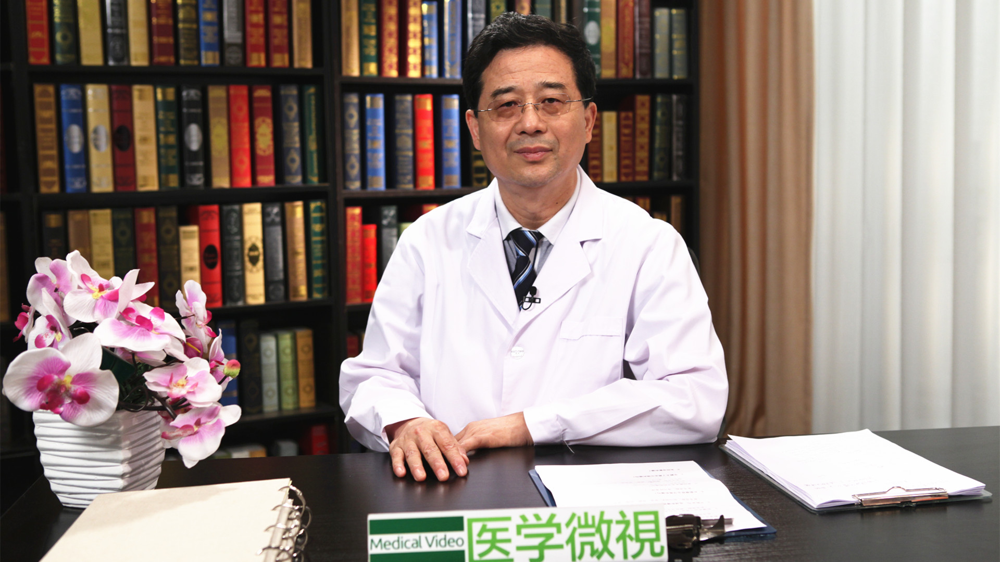

# 16.23 中医治疗阳痿

---

## 李海松 主任医师

北京中医药大学东直门医院男科主任 主任医师 男科研究所所长 博士研究生导师。

中华中医药学会男科分会副主任委员；中国医师协会中西医结合男科专家委员会副主任委员；中国中药协会男科药物研究专业委员会主任委员；北京中医药学会男科专业委员会主任委员；国家重点学科中医男科学科带头人。

**主要成就：** 先后承担国家973、自然基金、支撑计划等课题20多项，获各级奖励10项；发表论文150余篇，编写医学著作12部。

**专业特长：** 主要从事中医男科医教研工作，提出前列腺炎络病学说、前列腺感冒观点、从瘀论治前列腺炎、男性不育要微调阴阳、阳痿就是阴茎中风等观点。

---
