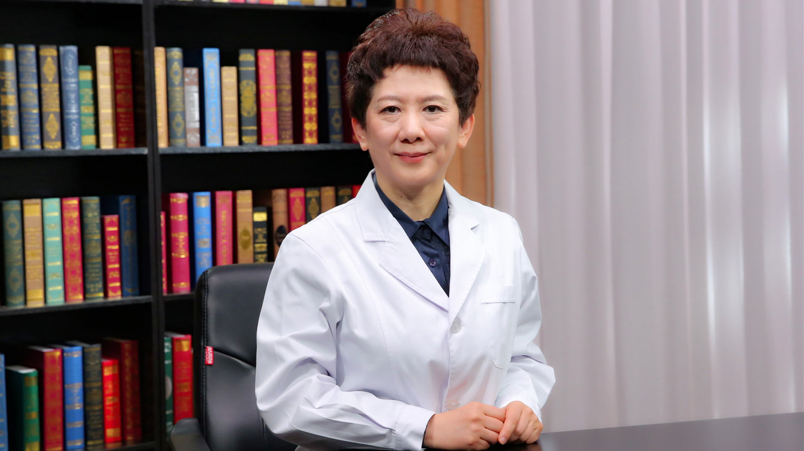

# 17.7 儿童气质

---

## 张劲松 主任医师

上海交通大学医学院附属新华医院临床心理科主任 心理学博士 医学硕士 硕士生导师。

中国心理卫生协会心理治疗与心理咨询专业委员会副主任委员 EMDR创伤心理治疗学组组长；中国妇幼保健协会儿童康复专业委员会副主任委员；中华医学会儿科分会发育行为儿科专业委员会专家；上海市心理卫生学会副理事长；上海市医学会精神医学专委会委员儿少组副组长 行为医学专委会委员。

**主要成就：** 发表论著80余篇；致力儿童心理行为发展和障碍的研究，主要研究儿童气质、自我调控、注意缺陷多动障碍共患品行障碍的机制和诊疗、儿童心理危机干预，承担相关课题多项。

**专业特长：** 擅长注意缺陷多动障碍及共患心理问题/精神障碍的复杂性病情，创伤和应激相关障碍，情绪相关障碍，抽动障碍的复杂病情和精神共患病，孤独症及伴情绪、冲动等精神症状，抽动障碍共病的诊治。

---
