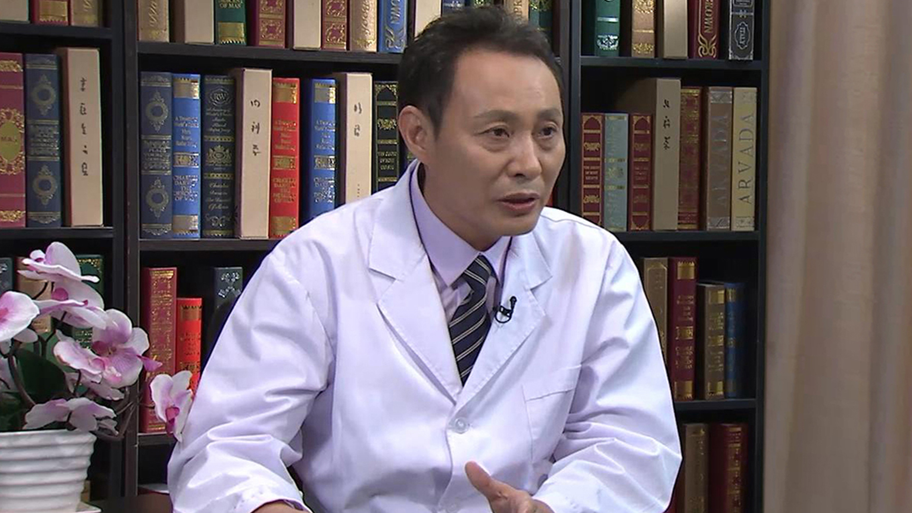

# 17.10 焦虑症

---

## 陈大春 主任医师

北京回龙观医院精神科主任 主任医师 知名专家 硕士生导师 教授。

北京回龙观医院金牌医生；中国精神卫生领域百姓满意好医生；四川省西部精神医学会重性精神障碍专业委员会委员；中华精神科杂志审稿专家；中国医药科学杂志审稿专家。

**主要成就：** 科研成果获北京市科技成果二等奖；北京市自然科研基金获得者；在国内外核心期刊发表论文100余篇，其中SCI论文30余篇，影响因子100多分。

**专业特长：** 抑郁焦虑症、强迫障碍、睡眠障碍、老年性精神障碍、精神分裂症及青少年心理障碍。

---
